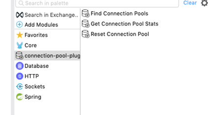

# connection-pool-stats-plugin
This connector can retrieve database-connection-pool metrics live from the JVM. JVM could be on cloudhub, hybrid or on-prem. Irrespective of the infrastructure, we use our Database connector to connect with databases. Either we use our own datasource to connect with database or one offered by Database connector. Whatever method we choose to connect with database, most of the Datasources have mechanism to register Mbeans to JMX server. This connector lets you connect
with local MBean Server and access Mbeans. You can packge this connector with your core db-system-api then you can either 
expose some end-points to view connection pool statistics or run some scheduled job to capture data.


### Why do we need to monitor connection pool?
*  To understand connection pool life cycle
* Helps to configure connection pool with right numbers/values rather than guessing
* Identify connection leaks
* Helps to understand connection-pool behaviors under different conditions (busy, idle, inactive connection etc)
* Perform administrative tasks

### Supported DataSources


* PoolDataSource: This is default DataSource used by our DB connector. For more information please refer to [docs](https://www.mchange.com/projects/c3p0/apidocs/com/mchange/v2/c3p0/PooledDataSource.html)
* Oracle UCP: DataSource to connect with Oracle DB. For more information please refer to [docs](https://docs.oracle.com/en/database/oracle/oracle-database/12.2/jjuar/oracle/ucp/admin/UniversalConnectionPoolMBean.html)


### Operations
This connector exposes following operations



* Find Connection Pools : Finds all connection-pool's Mbeans available on local MBeanServer
  
  
* Get Connection Pool Stats: Retrieve current metrics of a particular connection pool

  
* Reset Connection Pool: Reset specified connection pool. Based on type of datasource you have selected, this connector will invoke different method for resetting connection pool

     - [C3P0.PoolDataSource](https://www.mchange.com/projects/c3p0/apidocs/com/mchange/v2/c3p0/PooledDataSource.html)
    
     - [Oracle UCP](https://docs.oracle.com/cd/B28359_01/java.111/e11990/oracle/ucp/admin/UniversalConnectionPoolMBean.html#purge__)


### How  to install/use?
Clone this repository and run `mvn clean install` command on the parent `pom.xml`. This repository also contains a sample api
to demonstrate usage of the connector. 

Add this dependency to your application pom.xml
```
<dependency>
        <groupId>org.mule.consulting</groupId>
        <artifactId>connectionpool-stats-plugin</artifactId>
        <version>1.0.0-SNAPSHOT</version>
        <classifier>mule-plugin</classifier>
</dependency>
```

### Running test api
Once you import and run test-api, you can invoke below endpoints
* Retrieve Customer Data -> http://localhost:8081/api/customers
* Retrieve all mbeans  -> http://localhost:8081/api/connection-pool
* Retrieve Connection Pool Stats -> http://localhost:8081/api/connection-pool/stats/DERBY_DATA_SOURCE
* Reset Connection Pool -> http://localhost:8081/api/connection-pool/stats/DERBY_DATA_SOURCE
